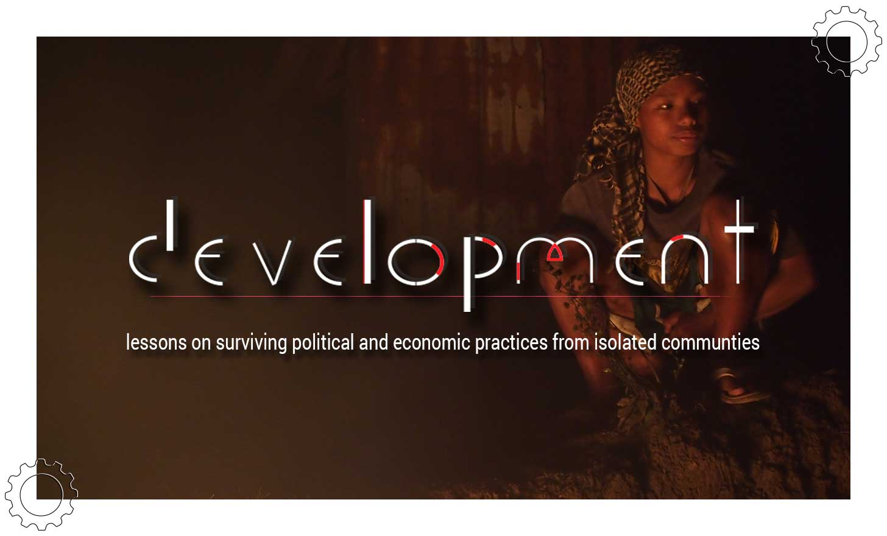
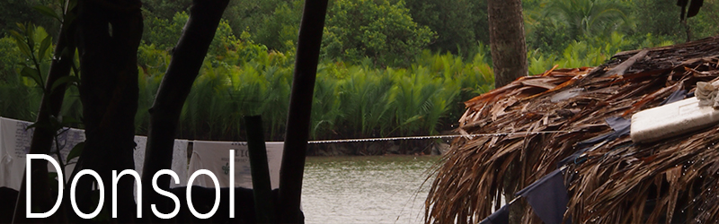
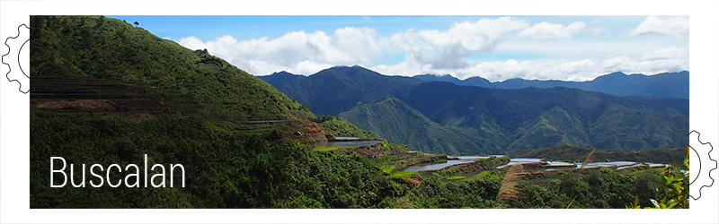
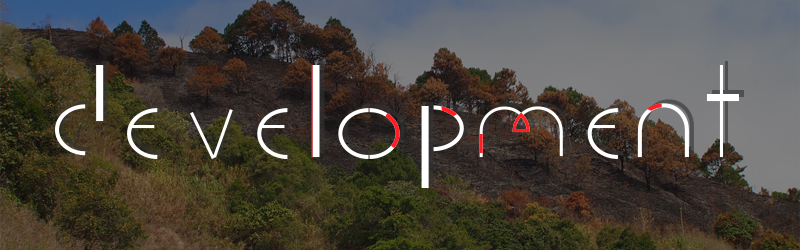

##Index

- [About](#about)
- [Methodology](#methodology)
- [Chapters](#chapters)
	- [Donsol, Philippines](#donsol-philippines)
	- [Buscalan, Philippines](#buscalan-philippines)
	- [Moinho, Brazil](#moinho-brazil)
- [Experiment](#experiment)	
- [Resources](#resources)
- [Contributing](#contributing)	
- [License](#license)

#About

This project was born from a growing disbelief in the political and economic structure of contemporary _civilized societies_. Ideas from economic anthropologists [Manfred Max-Neef](http://en.wikipedia.org/wiki/Manfred_Max_Neef) and [David Graeber](http://en.wikipedia.org/wiki/David_Graeber) led me to consider that alternatives that have sustained for a much longer period than our own system still exist in isolated rural areas around the globe. 

On December 2012 I began to search for communities that still had surviving forms of economic and political practices that were clearly distinct from the _status quo_. Once in contact with them, it became impossible to oversee the affects that states and global markets have had in an automated attempt to homogenize these cultures. 

Finally this is an endeavor to document these cultures during long intervals of time, as a way to critically analyze the affects of _development_ on quality of life of people; and also to keep detailed descriptions of alternative methods of organization to serve as inspiration for communities who may seek political and economic independence in times where decentralization has become critical.

#Methodology

Once I began seeking for isolated communities that had potential for surviving distinct economic and political practices, an outline for a method for actually finding, and most importantly for interacting, with them started to model itself. As this project is still alive and still gaining traction, this method is due to evolve along side the research.

Depend as little as possible on financial exchanges. 
Not interfere[*](#experiment) with local economy or politics.

#Chapters

###Donsol, Philippines

> December 2012 - February 2013

Lorem ipsum dolor sit amet, consectetur adipisicing elit. Laudantium natus esse labore consequuntur distinctio ducimus est quam consequatur accusantium, minima architecto saepe quidem impedit cumque quas blanditiis assumenda illo quibusdam!Lorem ipsum dolor sit amet, consectetur adipisicing elit. Delectus a dolor, enim illo vel porro animi. Rerum iusto dolores at totam velit porro? Sunt blanditiis hic est voluptatem quod ullam.

Lorem ipsum dolor sit amet, consectetur adipisicing elit. Nemo eligendi dolorum et. Necessitatibus dolorem accusamus veritatis delectus repellat, cupiditate architecto atque facilis nesciunt ut. Iste eveniet, maxime cum pariatur deleniti.Lorem ipsum dolor sit amet, consectetur adipisicing elit. Quaerat, praesentium quibusdam! Quibusdam, nobis! Voluptatibus, quam autem vel sequi officia impedit, modi consequuntur soluta reprehenderit similique omnis eius quod sed consectetur?

###Buscalan, Philippines

> February 2013 - March 2013
>
> June 2013 - July 2013

Lorem ipsum dolor sit amet, consectetur adipisicing elit. Laudantium natus esse labore consequuntur distinctio ducimus est quam consequatur accusantium, minima architecto saepe quidem impedit cumque quas blanditiis assumenda illo quibusdam!Lorem ipsum dolor sit amet, consectetur adipisicing elit. Delectus a dolor, enim illo vel porro animi. Rerum iusto dolores at totam velit porro? Sunt blanditiis hic est voluptatem quod ullam.

Lorem ipsum dolor sit amet, consectetur adipisicing elit. Nemo eligendi dolorum et. Necessitatibus dolorem accusamus veritatis delectus repellat, cupiditate architecto atque facilis nesciunt ut. Iste eveniet, maxime cum pariatur deleniti.Lorem ipsum dolor sit amet, consectetur adipisicing elit. Quaerat, praesentium quibusdam! Quibusdam, nobis! Voluptatibus, quam autem vel sequi officia impedit, modi consequuntur soluta reprehenderit similique omnis eius quod sed consectetur?

###Moinho, Brazil

> February 2014 - Present

Lorem ipsum dolor sit amet, consectetur adipisicing elit. Dolore perferendis iure molestiae quisquam repellendus architecto, minus doloremque, quaerat aliquam, delectus eius officiis sunt nulla saepe pariatur! Adipisci similique, aliquam officia.

Lorem ipsum dolor sit amet, consectetur adipisicing elit. Laudantium natus esse labore consequuntur distinctio ducimus est quam consequatur accusantium, minima architecto saepe quidem impedit cumque quas blanditiis assumenda illo quibusdam!Lorem ipsum dolor sit amet, consectetur adipisicing elit. Delectus a dolor, enim illo vel porro animi. Rerum iusto dolores at totam velit porro? Sunt blanditiis hic est voluptatem quod ullam.

Lorem ipsum dolor sit amet, consectetur adipisicing elit. Nemo eligendi dolorum et. Necessitatibus dolorem accusamus veritatis delectus repellat, cupiditate architecto atque facilis nesciunt ut. Iste eveniet, maxime cum pariatur deleniti.Lorem ipsum dolor sit amet, consectetur adipisicing elit. Quaerat, praesentium quibusdam! Quibusdam, nobis! Voluptatibus, quam autem vel sequi officia impedit, modi consequuntur soluta reprehenderit similique omnis eius quod sed consectetur?

#Experiment

No matter where, mobile devices have become ubiquitous, even without a network to support their use. The experiment will attempt to create an easy to deploy [mesh network](http://en.wikipedia.org/wiki/Mesh_networking) platform and provide digital tools as means to maintain and strengthen the existing forms of [gift economies](http://en.wikipedia.org/wiki/Gift_economy) and [consensus democracies](http://en.wikipedia.org/wiki/Consensus_democracy) within communities.

Open-source development of the platform is live at the [TribO repository](https://github.com/luandro/TribO).

#References

- Graeber, David (2009). [Debt: The First 5000 Years](http://theanarchistlibrary.org/library/david-graeber-debt-the-first-five-thousand-years)
- Max Neef, Manfred A (1992). [From the Outside Looking In: Experiences in Barefoot Economics](https://web.archive.org/web/20121021020841/http://www.max-neef.cl/download/Max_Neef_From_the_outside_looking_in.pdf)
- [Youtube playlist](https://www.youtube.com/playlist?list=PLJlVvky-wBN_l5zyWKEi0y6MjNIk0s3Nn) on the topic of economics.

#Contributing

Any feedback is very welcome, please enter the chat room to join the ongoing discussion.

#License

_***Development***_ is licensed under a Creative Commons Attribution-NonCommercial 4.0 International License.